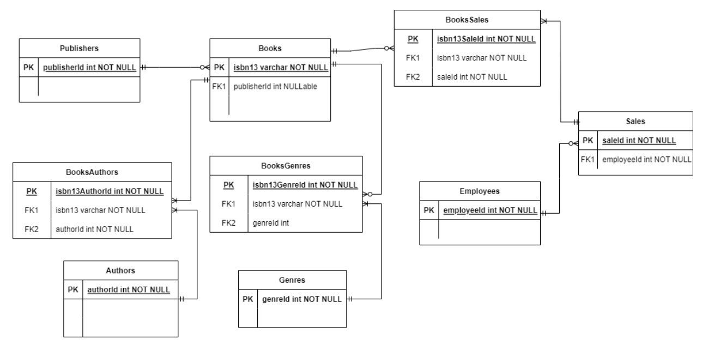
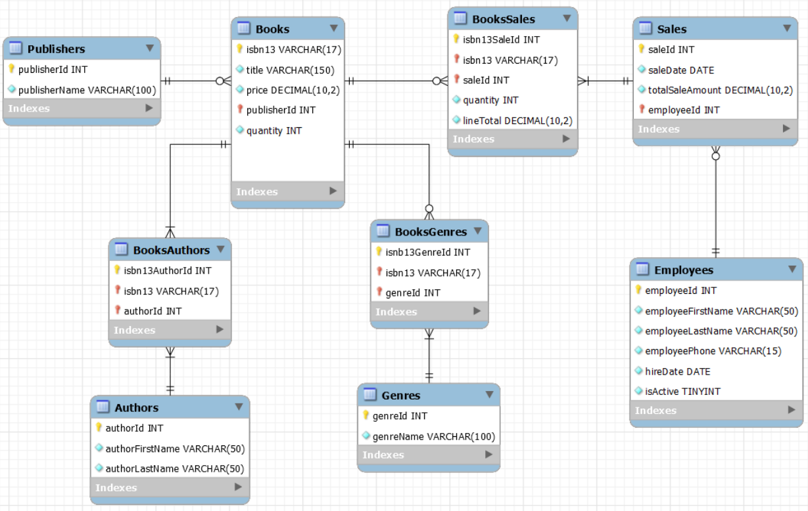
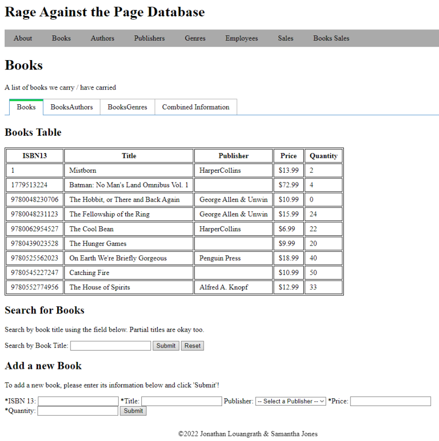

# "Rage Against the Page" - Bookstore Database

This web application to tracks a bookstore's inventory.

## Description

The database uses MySQL data manipulation queries for create-read-update-delete (CRUD) functionality. CRUD operations are used for titles, authors, publishers, genres, employees, and sales. See below for Entity Relationship (ER) and schema diagrams to illustrate the database's relationships.

## Case Study

Rage Against the Page is a locally owned and operated, independent bookstore with a single
location in Boston. They sell their products in person only, and over the last few months, their
business has been growing rapidly due to community engagement and quality of face-to-face
customer service. Rage Against the Page brings in roughly $1 million in annual sales, keeping
an average of 10,000 - 12,000 books in stock at all times, with 16,000 - 19,000 units present on
shelves and in backstock. Due to their rapid growth, their impressively complicated excel
spreadsheet is no longer sufficient to manage their business. They are in need of a database
driven back-end to track their inventory of Books, keep records of Employee information, and be
capable of recording 60,000 Sales of individual books annually. In addition to this, they would
like to be able to search their inventory based on Authors, Publishers, and Genres, as well as
receive sales reports. They are not concerned with tracking customers themselves, but rather
just the books sold. Sales will be attributed to specific employees.

## Getting Started

### Dependencies

* Node.js
* Express.js
* MariaDB
* Handlebars

### Entity Relationship Diagram

### Schema Diagram

### User Interface

## Authors

Contributors names and contact info

* [Jonathan Louangrath](https://github.com/jontlo)
* [Samantha Jones](https://github.com/kanisxlupus)

## License

This project was created for Oregon State University's CS_340_400_F2022 course.

## Acknowledgments

* [README template](https://gist.github.com/DomPizzie/7a5ff55ffa9081f2de27c315f5018afc)
